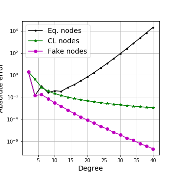
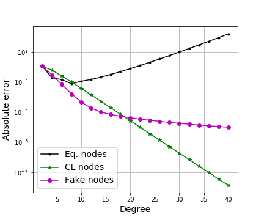

# FakeQuadrature

FOSS Python software related to the Fake Nodes approach for getting a better quadrature without computing new samples.

Authors: S. De Marchi, G. Elefante, E. Perracchione, D. Poggiali, 
Universita' di Padova.

## Quote this work

To use this work in any scientific report or publication, please cite:

  * S. De Marchi, G. Elefante, E. Perracchione, D. Poggiali, *Quadrature at fake nodes* [link](), preprint.
  * S. De Marchi, F. Marchetti, E. Perracchione, D. Poggiali, *Polynomial interpolation via mapped bases without resampling* [link](https://www.sciencedirect.com/science/article/pii/S0377042719303449), JCAM.
 



## How to use this software
Clone this repo in your folder and import it
```python
import numpy as np
from fakequadrature import quadrature_weights
```
then define the function you want to integrate, the mapping function S and the nodes of quadrature, for instance

```python
from scipy.special import erf
f = lambda x: erf( x )
S = lambda x: -2 * np.cos( np.pi* (x+2)/2 )
x = np.linspace( -2, 2, 20 )
```

so you can now compute the integral of $f(x)$ in the interval $[-2,2]$ with S-FakeNodes

```python
weights = quadrature_weights( x, (-2,2), mapping = S )
Integral = np.dot( f(x) , weights ) 
```
 if you want to compute the approximate integral the usual way, it is sufficient **not** to specify a mapping $S$.


## Fake Nodes for quadrature

This software extends the fake nodes approach to quadrature formula for mitigating 
both Runge and Gibbs phenomena when computing the quadrature wheigts. 



Quadrature under Fake Nodes mitigate the Runge and Gibbs effect.


