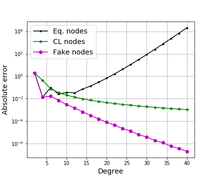

# FakeQuadrature

Free Python software related the the paper (cite as): 
Quadrature at fake nodes, preprint 2020, link: ???????????

This software extends the fake nodes approach to quadrature formulae

Authors: S. De Marchi, G. Elefante, E. Perracchione, D. Poggiali, 
Universita' di Padova

Last modified: 08/01/20.

The script provides an example of the use of the fake nodes for mitigating 
both Runge and Gibbs phenomena when computing the quadrature wheigts. 

An example, which can be recovered with the notebooks S-Runge.ipynb
and S-Gibbs.ipynb, we refer to the following figures. 

Quadrature under Fake Nodes mitigating the Runge and Gibbs effect.

